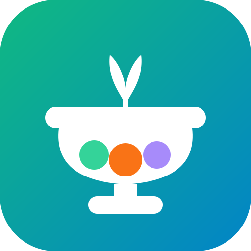

# 🥗 Calorie Tracker

En gratis kalori- og vekttracker for flere brukere. Registrer deg, logg inn og start tracking — fungerer på alle enheter.

**Live app → [andos80.github.io/calorie-tracker](https://andos80.github.io/calorie-tracker/)**

---

## Installer på telefonen

Appen kan legges til på hjemskjermen og fungerer som en native app — ingen App Store nødvendig.

### iPhone / iPad (Safari)
1. Åpne **[andos80.github.io/calorie-tracker](https://andos80.github.io/calorie-tracker/)** i **Safari**
2. Trykk på **Del**-knappen (boksen med pil nederst på skjermen)
3. Scroll ned og trykk **"Legg til på hjemskjerm"**
4. Trykk **Legg til** — app-ikonet vises på hjemskjermen

### Android (Chrome)
1. Åpne lenken i **Chrome**
2. Trykk på **⋮**-menyen (øverst til høyre)
3. Trykk **"Legg til på startskjermen"**
4. Trykk **Legg til** — ferdig

---

## Funksjoner

### 👤 Innlogging
- Registrer deg med e-post og passord
- Hver bruker har sin helt egen data — ingen ser andres innlegg
- Dataene er tilgjengelige på alle enheter du logger inn fra
- Logg ut med 🚪-knappen i headeren

### 📅 I dag
- Sett daglig kalori-mål og følg fremgang med en progressbar
- Logg måltider fra det innebygde matbiblioteket med **150+ matvarer**
- Smarte enheter per matvare — egg i stk, melk i glass, brød i skiver, øl i cl osv.
- Fargekodet makrofordeling — 🟣 Protein · 🟠 Karbohydrater · 🟡 Fett
- Legg til hva som helst manuelt med fulle makroverdier
- Naviger til hvilken som helst dato med pilknappene
- Eksporter og importer dine data som `.json`-backup

### 💧 Vanntracker
- Hurtigtillegg-knapper: **+1 glass**, **+33 cl**, **+50 cl**, eller skriv inn egendefinert mengde
- Visuell progressbar og animerte vanndråpe-ikoner
- Daglig mål på 2000 ml, nullstilles automatisk hver dag

### 🔍 Søk mat
- Bla i matbiblioteket etter kategori med emoji-filterbrikker
- Sanntidssøk filtrerer biblioteket mens du skriver
- Søk på norsk (f.eks. "kylling" finner "Chicken breast")
- **Søk online** via [Open Food Facts](https://world.openfoodfacts.org/) for alt som ikke er i biblioteket

### 📆 Kalender
- Full månedsoversikt med kalorier logget for hver dag
- 🟢 Grønn = under mål · 🔴 Rød = over mål
- Naviger mellom måneder med pilknappene
- Trykk på en dag for å hoppe til logging for den datoen

### ⚖️ Vekt
- Logg vekten din så ofte du vil
- Sett et vektmål for å spore fremgang
- Statistikk: startvekt · nåværende vekt · total endring · mål
- Linjediagram med **1M / 3M / 6M / Alt** periodevisning

### 📊 Historikk
- Søylediagram med daglige kaloritotaler for de siste **7, 14 eller 30 dagene**
- Søyler blir røde på dager du gikk over målet
- Stiplet mållinje for enkel visuell referanse

### 🌍 Norsk / Engelsk
- Bytt språk med flagg-knappen i headeren
- Matvarer og kategorier oversettes automatisk

### 🌙 Mørk modus
- Bytt mellom lys og mørk med knappen i hjørnet
- Preferanse lagres automatisk

---

## Matbibliotek

**150+ matvarer** fordelt på 14 kategorier med nøyaktige kalori- og makroverdier.

| Kategori | Eksempler |
|----------|-----------|
| 🥚 Eggs & Dairy | Egg, melk, ost, yoghurt, smør |
| 🥩 Meat & Fish | Kylling, laks, biff, tunfisk, reker |
| 🍞 Bread & Grains | Brød, ris, pasta, havre, poteter |
| 🥦 Vegetables | Brokkoli, gulrot, tomat, spinat, paprika |
| 🍎 Fruits | Eple, banan, jordbær, mango, blåbær |
| 🥤 Drinks | Vann, juice, kaffe, øl, vin |
| 🍫 Snacks & Other | Nøtter, sjokolade, chips, olivenolje |
| 🍞 Brød & Pålegg | Grovbrød, brunost, skinke, leverpostei, kaviar |
| 🍝 Middag | Kyllingfilet, laks, kjøttkaker, fårikål, grandiosa |
| 🥐 Bakevarer | Havregrøt, bolle, vaffel, pannekake, kanelsnurr |
| 🥛 Meieri | Lettmelk, skyr, rømme, fløte |
| 🍫 Snacks | Kvikk Lunsj, Smash, Daim, Twist, smågodt |
| 🥤 Norsk Drikke | Cola, Solo, Saft, Litago, Energidrikk |
| 🍔 Fast Food | Big Mac, kebab, pizza, nuggets, McFlurry |

---

## Skylagring & synkronisering

All data lagres i **Supabase** og er koblet til din brukerkonto. Du kan logge inn fra hvilken som helst enhet og se din data.

- Data synkroniseres automatisk når du bytter mellom enheter
- Synk-ikonet i headeren viser status: **⏳** laster · **✅** oppdatert · **❌** feil
- Trykk på **✅**-ikonet for å tvinge en manuell oppdatering fra skyen

**Backup og gjenoppretting:**
1. Gå til **I dag**-fanen og scroll ned til **Your data**-kortet
2. Trykk **⬇ Export** — laster ned en `calorie-tracker-YYYY-MM-DD.json`-fil
3. Trykk **⬆ Import** og velg filen for å gjenopprette alt

---

## Kom i gang

1. Åpne **[andos80.github.io/calorie-tracker](https://andos80.github.io/calorie-tracker/)**
2. Registrer deg med e-post og passord
3. Bekreft e-posten din (sjekk innboksen)
4. Sett ditt daglige kalori-mål og start logging

---

## Teknologi

- Én HTML-fil — ingen rammeverk, ingen byggesteg
- Brukerdata lagret i [Supabase](https://supabase.com/) med Row Level Security per bruker
- Innlogging via Supabase Auth (e-post/passord)
- Installbar som PWA via `manifest.json`
- Matsøk via [Open Food Facts](https://world.openfoodfacts.org/)
- Grafer med [Chart.js](https://www.chartjs.org/)
- Hostet gratis på [GitHub Pages](https://pages.github.com/)
